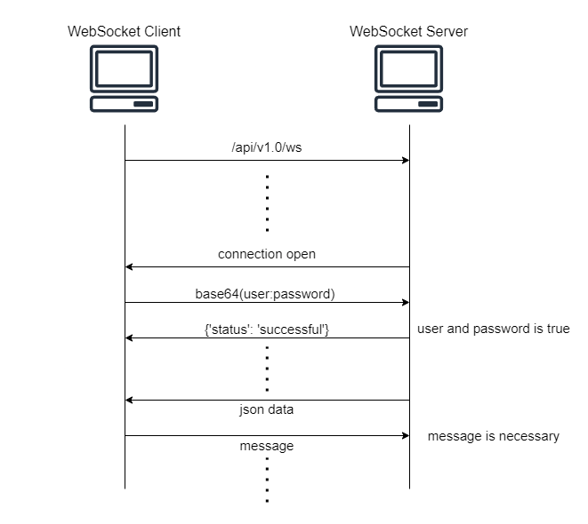

# backend(FastAPI)のAPI仕様

## data format

tickets  
{ item_number: int , status: , create_time: hh:mm}  
status: [delete, cancel, wait, ready]

collections  
{ item_type: , count: int }  
item_type: ['A', 'B', ...]

## main
 - 呼び出し済みリスト GET /api/v1.0/ready  
```curl http://localhost:8080/api/v1.0/ready```  
{"status":200,"data":{"A":[{"itemNumber": 1, "createTime": "10:22"}, {"itemNumber": 2, "createTime": "10:23"}],"B":[{"itemNumber": 1, "createTime": "10:22"}]}}  
{
    "status":200,
    "data":{
        "A":[
            {
                "itemNumber":1,
                "createTime":"10:22"
            },
            {
                "itemNumber":2,
                "createTime":"10:23"
            }
        ],
        "B":[
            {
                "itemNumber":1,
                "createTime":"10:22"
            }
        ]
    }
}


 - 呼び待ち済みリスト GET /api/v1.0/wait  
```curl http://localhost:8080/api/v1.0/wait```  
{"status":200,"data":{"A":[{"itemNumber": 3, "createTime": "10:20"}, {"itemNumber": 4, "createTime": "10:21"}],"B":[{"itemNumber": 2, "createTime": "10:21"}]}}  
{
    "status":200,
    "data":{
        "A":[
            {
                "itemNumber":3,
                "createTime":"10:20"
            },
            {
                "itemNumber":4,
                "createTime":"10:21"
            }
        ],
        "B":[
            {
                "itemNumber":2,
                "createTime":"10:21"
            }
        ]
    }
}

## admin
 - 呼び出し済みリスト 呼び待ち済みリスト GET /api/v1.0/admin/A  
```curl -u user:password http://localhost:8080/api/v1.0/admin/A```  
{"status":200,"data":{"ready":[{"itemNumber": 1, "createTime": "10:22"}, {"itemNumber": 2, "createTime": "10:20"}],"wait":[{"itemNumber": 3, "createTime": "10:21"},{"itemNumber": 4, "createTime": "10:20"}]}}  
{
    "status":200,
    "data":{
        "ready":[
            {
                "itemNumber":1,
                "createTime":"10:22"
            },
            {
                "itemNumber":2,
                "createTime":"10:20"
            }
        ],
        "wait":[
            {
                "itemNumber":3,
                "createTime":"10:21"
            },
            {
                "itemNumber":4,
                "createTime":"10:20"
            }
        ]
    }
}

 - 呼び出し済みリスト 呼び待ち済みリスト GET /api/v1.0/admin/B  
```curl -u user:password http://localhost:8080/api/v1.0/admin/B```  
{"status":200,"data":{"ready":[{"itemNumber": 1, "createTime": "10:21"}],"wait":[{"itemNumber": 2, "createTime": "10:20"}]}}  
{
    "status":200,
    "data":{
        "ready":[
            {
                "itemNumber":1,
                "createTime":"10:21"
            }
        ],
        "wait":[
            {
                "itemNumber":2,
                "createTime":"10:20"
            }
        ]
    }
}


 - A発券 POST /api/v1.0/ticketing  
```curl -u user:password -X POST -H "Content-Type: application/json" -d '{"itemType":"A"}' http://localhost:8080/api/v1.0/ticketing```  
{"status":200,"data":{"itemNumber":1}}

 - B発券 POST /api/v1.0/ticketing  
```curl -u user:password -X POST -H "Content-Type: application/json" -d '{"itemType":"B"}' http://localhost:8080/api/v1.0/ticketing```  
{"status":200,"data":{"itemNumber":1}}

 - キャンセル POST /api/v1.0/cancel  
```curl -u user:password -X POST -H "Content-Type: application/json" -d '{"itemType":"A", "itemNumber": 1}' http://localhost:8080/api/v1.0/cancel```  
{"status":200}

 - 呼び済み移動 POST /api/v1.0/to_ready  
```curl -u user:password -X POST -H "Content-Type: application/json" -d '{"itemType":"A", "itemNumber": 1}' http://localhost:8080/api/v1.0/to_ready```  
{"status":200}


 - 呼び待ち移動 POST /api/v1.0/to_wait  
```curl -u user:password -X POST -H "Content-Type: application/json" -d '{"itemType":"A", "itemNumber": 1}' http://localhost:8080/api/v1.0/to_wait```  
{"status":200}


 - 削除 POST /api/v1.0/delete  
```curl -u user:password -X POST -H "Content-Type: application/json" -d '{"itemType":"A", "itemNumber": 1}' http://localhost:8080/api/v1.0/delete```  
{"status":200}


## collection
 - 集計結果取得 /api/v1.0/collection  
```curl -u user:password http://localhost:8080/api/v1.0/collection```  
{"status":200,"data":{"A":{"count":3},"B":{"count":1}}}

 - リセット機能 /api/v1.0/reset  
```curl -u user:password -X POST http://localhost:8080/api/v1.0/reset```  
{"status":200}



## ws send json data
 - {'status': 'add', 'itemNumber': item_number, 'itemType': item_type, 'createTime': create_time}
 - {'status': 'move', 'before': 'wait', 'after': 'ready', 'itemNumber': item_number, 'itemType': item_type}
 - {'status': 'move', 'before': 'ready', 'after': 'wait', 'itemNumber': item_number, 'itemType': item_type}
 - {'status': 'delete', 'location': 'wait', 'itemNumber': item_number, 'itemType': item.item_type}
 - {'status': 'delete', 'location': 'ready', 'itemNumber': item_number, 'itemType': item_type}
 - {'status': 'reset'}
